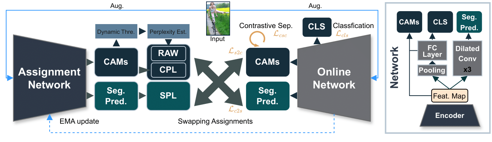

# CoSA &nbsp;&nbsp;&nbsp;&nbsp;&nbsp;&nbsp;&nbsp;&nbsp;&nbsp;&nbsp;&nbsp;&nbsp;&nbsp;&nbsp;&nbsp;&nbsp;&nbsp;&nbsp;&nbsp;&nbsp;&nbsp;&nbsp;&nbsp;&nbsp;&nbsp;&nbsp;&nbsp;&nbsp;&nbsp;&nbsp;&nbsp;&nbsp;&nbsp;&nbsp;&nbsp;&nbsp;[](https://eccv2024.ecva.net/)&nbsp;&nbsp;[](http://arxiv.org/abs/2402.17891)

**Weakly Supervised Co-training with Swapping Assignments for Semantic Segmentation**

Xinyu Yang, Hossein Rahmani, Sue Black, Bryan M. Williams


[](https://paperswithcode.com/sota/weakly-supervised-semantic-segmentation-on?p=weakly-supervised-co-training-with-swapping)
[](https://paperswithcode.com/sota/weakly-supervised-semantic-segmentation-on-4?p=weakly-supervised-co-training-with-swapping)

## Overview
We propose an end-to-end framework for WSSS: Co-training with Swapping Assignments (**CoSA**),
<p align="middle">

</p>

---
## Usage

### 1. Data Preparation

<details>
<summary>
COCO dataset
</summary>

#### 1. Download and Extract COCO 2014
``` bash
mkdir coco
cd coco
wget http://images.cocodataset.org/zips/train2014.zip
wget http://images.cocodataset.org/zips/val2014.zip
wget http://images.cocodataset.org/zips/test2014.zip
unzip ./train2014.zip
unzip ./val2014.zip
unzip ./test2014.zip
```

#### 2.  Download Segmentation Labels

[Here](https://drive.google.com/file/d/147kbmwiXUnd2dW9_j8L5L0qwFYHUcP9I/view?usp=share_link) to download the COCO segmentation labels `coco_anno.tar` and move it to `coco` dir.
After that you should extract it by running:
```bash
tar -xvf coco_anno.tar
```
then you should have a directory structure like this (the number in the brackets is the number of images):
``` bash
coco/
├── SegmentationClass
│   ├── train2014 (82081)
│   └── val2014 (40137)
├── test2014 (40775)
├── train2014 (82783)
└── val2014 (40504)
```
</details>

<details>
<summary>
VOC dataset
</summary>

#### 1. Download PASCAL VOC 2012 and Extract

``` bash
wget http://host.robots.ox.ac.uk/pascal/VOC/voc2012/VOCtrainval_11-May-2012.tar
tar –xvf VOCtrainval_11-May-2012.tar
```
#### 2. Download the augmented annotations
[Here](https://www.dropbox.com/s/oeu149j8qtbs1x0/SegmentationClassAug.zip?dl=0) is a download link of the augmented annotations. After downloading ` SegmentationClassAug.zip `, you should unzip it and move it to `VOCdevkit/VOC2012`. The directory structure should be like this (the number in the brackets is the number of images):

``` bash
VOCdevkit/
└── VOC2012
    ├── Annotations
    ├── ImageSets
    ├── JPEGImages (17125)
    ├── SegmentationClass
    ├── SegmentationClassAug (12031)
    └── SegmentationObject (2913)
```
</details>


### 2. Setup Python Environment
We recommend using Anaconda to create a virtual environment.
``` bash
 conda create -yn cosa python=3.10 pip wheel
 conda activate cosa
 pip install -r requirements.txt
```
after that, you can install some extension packages: `mmcv`, `bilateralfilter` and `pydensecrf` by running:
``` bash
mim install mmcv-lite
pip install git+https://github.com/lucasb-eyer/pydensecrf.git
cd utils/bilateralfilter
#sudo apt install swig
swig -python -c++ bilateralfilter.i
python setup.py install
```
## 3. Train and Evaluate
``` bash

### train and eval coco, you may need to modify the `coco_root` in `run_coco.sh` to the path of your COCO dataset.
sh run_coco.sh

### train and eval voc, you may need to modify the `voc12_root` in `run_voc.sh` to the path of your VOC dataset.
sh run_voc.sh

```

## Tested Environment
- Ubuntu 20.04 LTS x86_64
- CUDA 12.1
- NVIDIA GeForce RTX 3090 x2
- Python 3.10

## Our Results
Semantic performance on VOC and COCO. Logs and weights are available now.
| Dataset   | Backbone   | Val     | Test                                                           | Log                             | Weight     |
| :-------: | :--------: | :-----: | :----:                                                         | :---:                           | :------:   |
| COCO      | ViT-B      | 51.0    | -                                                              | [log](assets/logs/coco_log.txt) | [weight](https://github.com/youshyee/CoSA/releases/download/weight_release/coco_weights.pth) |
| VOC       | ViT-B      | 76.2    | [75.1](http://host.robots.ox.ac.uk:8080/anonymous/GOZOHI.html) | [log](assets/logs/voc_log.txt)  | [weight](https://github.com/youshyee/CoSA/releases/download/weight_release/voc_weights.pth) |

Visualization results for CoSA comparing with [MCT](https://github.com/xulianuwa/MCTformer), [ToCo](https://github.com/rulixiang/ToCo) and [BECO](https://github.com/ShenghaiRong/BECO) on COCO:

<p align="middle">

</p>

<p align="middle">

</p>

Visualization results for CoSA comparing with [MCT](https://github.com/xulianuwa/MCTformer), [ToCo](https://github.com/rulixiang/ToCo) and [BECO](https://github.com/ShenghaiRong/BECO) on VOC:

<p align="middle">

</p>


The code and weights for CoSA-MS are coming soon.

## Citation
Please cite our work if you find it helpful:
```bash
@article{yang2024weakly,
  title={Weakly supervised co-training with swapping assignments for semantic segmentation},
  author={Yang, Xinyu and Rahmani, Hossein and Black, Sue and Williams, Bryan M},
  journal={arXiv preprint arXiv:2402.17891},
  year={2024}
}

```


## Acknowledgement
This repo is heavily built upon [ToCo](https://github.com/rulixiang/ToCo) and [MCT](https://github.com/xulianuwa/MCTformer). Please consider citing their works if you find this repo helpful.
