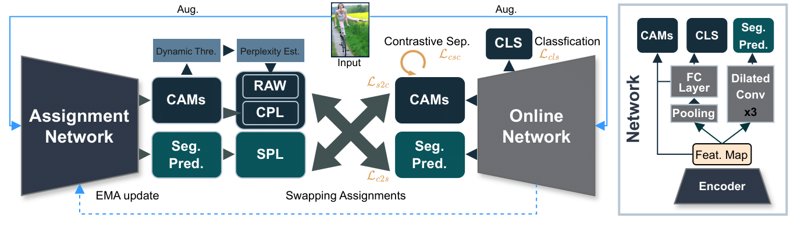

<link rel="shortcut icon" type="image/x-icon" href="favicon.ico">
<p align="center" style="font-size:30px">
<a href="https://youshye.com/">Xinyu Yang</a> , Hossein Rahmani, Sue Black, Bryan M. Williams
</p>

[](https://paperswithcode.com/sota/weakly-supervised-semantic-segmentation-on?p=weakly-supervised-co-training-with-swapping)
[](https://paperswithcode.com/sota/weakly-supervised-semantic-segmentation-on-4?p=weakly-supervised-co-training-with-swapping)


## Abstract
Class activation maps (CAMs) are commonly employed in weakly supervised semantic segmentation (WSSS) to produce pseudo-labels. Due to incomplete or excessive class activation, existing studies often resort to offline CAM refinement, introducing additional stages or proposing offline modules. This can cause optimization difficulties for single-stage methods and limit generalizability. In this study, we aim to reduce the observed CAM inconsistency and error to mitigate reliance on refinement processes. We propose an end-to-end WSSS model incorporating guided CAMs, wherein our segmentation model is trained while concurrently optimizing CAMs online. Our method, Co-training with Swapping Assignments (CoSA), leverages a dual-stream framework, where one sub-network learns from the swapped assignments generated by the other. We introduce three techniques: i) soft perplexity-based regularization to penalize uncertain regions; ii) a threshold-searching approach to dynamically revise the confidence threshold; and iii) contrastive separation to address the coexistence problem. CoSA demonstrates exceptional performance, achieving mIoU of 76.2% and 51.0% on VOC and COCO validation datasets, respectively, surpassing existing baselines by a substantial margin. Notably, CoSA is the first single-stage approach to outperform all existing multi-stage methods including those with additional supervision.


## Framework Overview



 We propose an end-to-end dual-stream weakly-supervised segmentation framework, capable of co-optimizing the segmentation prediction and CAMs by leveraging the swapped assignments, namely CAM pseudo-labels (CPL) and segmentation pseudo-labels (SPL). Our framework comprises two networks: an assignment network (AN) and an online network (ON), where the AN is responsible for generating pseudo-labels for training the ON. While the AN has identical architecture to the ON, it is updated through exponential moving average (EMA) of the ON. The diagram on the right provides an illustration of the architecture. Given weak-augmented images as input, the AN produces CPL to supervise segmentation in the ON . During training, the CPL is softened by reliability-based adaptive weighting (RAW), formed based on CAM perplexity estimation and dynamic thresholding. The AN also generates SPL which is utilized to supervise the CAMs. Further, the CAMs are regularized to contrastively separate the foreground from the background regions . Note that the ON is also trained for classification using the image-level class labels.

## SPL-guided CAMs


## CPL Analysis


##  Coexistence Problem


## Comparison with SOTA

On COCO dataset:


On VOC dataset:


## Paper

[PDF](https://youshyee.com/pdfs/CoSA.pdf) &nbsp;&nbsp;&nbsp;&nbsp;&nbsp;&nbsp;&nbsp;&nbsp;&nbsp;&nbsp;&nbsp;&nbsp;&nbsp;&nbsp;&nbsp;
[Poster](./cosa_poster.pdf)&nbsp;&nbsp;&nbsp;&nbsp;&nbsp;&nbsp;&nbsp;&nbsp;&nbsp;&nbsp;&nbsp;&nbsp;&nbsp;&nbsp;&nbsp;
[ArXiv](https://arxiv.org/abs/2402.17891)


## Bibtex

```markdown
@article{yang2024weakly,
  title={Weakly supervised co-training with swapping assignments for semantic segmentation},
  author={Yang, Xinyu and Rahmani, Hossein and Black, Sue and Williams, Bryan M},
  journal={arXiv preprint arXiv:2402.17891},
  year={2024}
}
```
